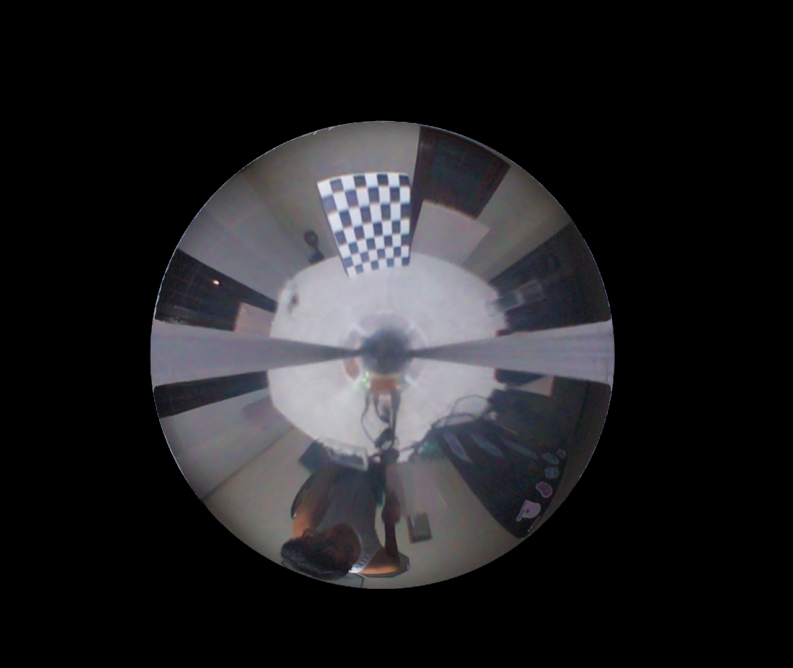
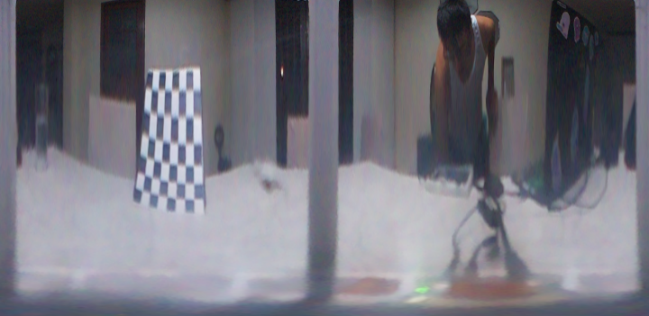
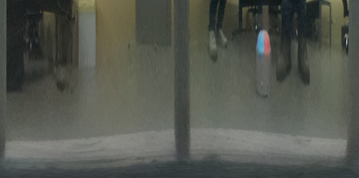

# 📷 Sistema de Visión Omnidireccional con Espejo Hiperbólico  

Este proyecto implementa un sistema de **visión omnidireccional** usando una cámara y un **espejo hiperboloidal**, para generar imágenes panorámicas y realizar segmentación de colores.  
El desarrollo se realizó en **MATLAB** y **Python (OpenCV)**, organizando el flujo en:  
1. Captura de imágenes con espejo.  
2. Eliminación de distorsión.  
3. Generación de panorámicas.  
4. Segmentación en distintos espacios de color (RGB, HSV).  
---
Aquí hay una imagen de ejemplo del sistema, sin distorsión:



---
Imagen de ejemplo panoramica recontruida:



---
Imagen de ejemplo panoramica recontruida en campo de prueba del sistema:



## 📂 Estructura del proyecto  

```bash
VisionsystemProject/
├── calib_output/              # Resultados/calibraciones de la cámara-- los parametros intrisecos extrinsecos y de calibración
├── fotos_1280_1080/           # Imágenes redimensionadas en 1280x1080 
├── fotos_cam/                 # Fotos originales de la cámara para la calibración
├── fotos_cam_segmentadas/     # Resultados de segmentación de cámara, aplicación de la mascara
├── img_sindistor/             # Imágenes corregidas sin distorisón (undistort)
├── MatlabCode/                # Scripts en MATLAB para procesar las imagenes en Matlab
├── OpenCV_code/               # Scripts en Python/OpenCV para iterar y mejorar el procesamiento, mejorar
├── panos/                     # Panorámicas reconstruidad del sistema
├── salidas/                   # Carpeta de salidas con imágenes en prueba del sistema
├── 0Reescalar_img.mlx         # Script de MATLAB para reescalar imágenes al tamaño deseado de 1280x1080 o el que se desee
├── 1Mascara_imagenes.mlx      # Script de MATLAB para generación de máscaras para espejo
├── 2_Sin_distorsion.mlx       # Script de MATLAB para corrección de distorsión
├── 3_panoramicas.mlx          # Script de MATLAB para reconstrucción de panorámicas
├── espejo_mask.mat            # Archivo con máscara del espejo los parametros para aplicarla en otras imágenes
├── img_pro.py                 # Script Python de procesamiento de imágenes que se capturan por el sistema, quita distorsion y genera panoramicas del sistema
├── segmentacionHSV.py         # Script python para segmentación HSV en imágenes sin distrosión undistort
├── segmentacionHSV_panos.py   # Script python para segmentación HSV en imágenes panorámicas
├── requirements.txt           # Dependencias necesarias en Python
└── README.md                  # Este archivo 
```
## ⚙️ Requisitos

Si desear realizar tu propia calibración, corre los scripts matlab para esto, caso contrario, el repositorio contiene los archivos con los parametros de calibración necesarios apra utilizar el sistema siempre y cuando cumpla las mismas condiciones. 
Para utilizar los códigos python se necesita:

- Python 3.8+

- OpenCV

- NumPy

- SciPy

- Matplotlib

- PyYAML

> Instalar dependencias necesarias

```bash
    pip install -r requirements.txt
```

## 🚀 Flujo de trabajo

Captura de imágenes en fotos_cam/.

Preprocesamiento y máscara (1Mascara_imagenes.mlx).

Corrección de distorsión (2_Sin_distorsion.mlx).

Reconstrucción de panorámicas (3_panoramicas.mlx).

Segmentación de colores usando segmentacionHSV.py o segmentacionHSV_panos.py.

# 📊 Ejemplo de uso
***Segmentación sobre imágenes sin distorsión***
```bash
python segmentacionHSV.py
```

***Segmentación sobre imágenes panorámicas***
```bash
python segmentacionHSV_panos.py
```
# 🧑‍💻 Autor

Gabriel M. Madroñero P.